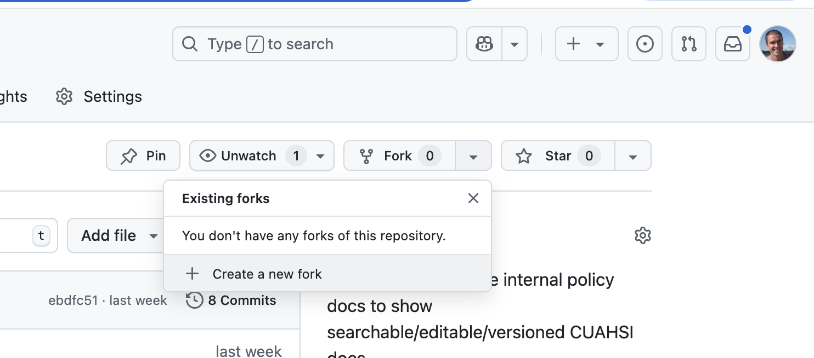

# Contribute

## Quick Start
We welcome your contributions to these policy documents! If you would like to contribute to the development of the pages within this repository, you have the following options:

1. Navigate to [GitHub repository](https://github.com/CUAHSI/CUAHSI-policies), fork the repository, make edits or add content, and then make a pull request

2. Edit the best practice documents directly in GitHub and submit a pull request using the steps below
3. [Create an issue](https://github.com/CUAHSI/CUAHSI-policies/issues) in the GitHub Repository and post your suggested edits or content in that issue.

You will need a GitHub account. If you don't have one already, you'll need to go to [https://github.com](https://github.com) to create a user account. If you don't have experience with GitHub already, we suggest that you use the directions below to make your edits directly in GitHub or just shoot us an email.

## Editing Policy Documents Directly in GitHub

Coming soon

## Previewing Your Changes Locally, Like a Total BOSS!!
This site is built using `mkdocs`, which is one of the simpler tools used to render structured markdown text files into an indexed set of HTML pages. We use an extension to `mkdocs` that adds some better styling options (namely, the `material` theme) so this extension needs to be installed too. 

You can install with `pip` or `brew` (mac). I'm using [`brew`](https://brew.sh/) and someone else will help us out later by adding the instructions for `pip`, which is a python package installer. 

1. Assuming you have `brew` installed, use the command line:
```
brew install mkdocs
```
2. Also in the command line, install the `material` theme:
```
brew install mkdocs-material
```
3. Navigate to the root folder of this repository in command line if you aren't there already, and using the `mkdocs` command to simultaneously build and host your version of the website locally:
```
mkdocs serve
```
4. Assuming `serve` works without error, it will give you a local address to view the site (e.g., mine was `Serving on http://127.0.0.1:8000/`)
5. Navigate a web browser to the local address and view the site. As you continue to modify files locally, including modifying and saving *.md files, the new content will be re-rendered and you can see the updates in the website. 
